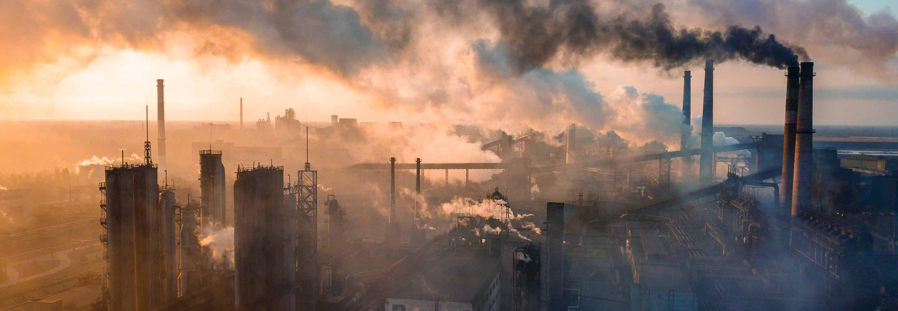

# Socio-economic disparities in exposure to air pollution in German cities

This is just a copy of the project repository for a paper by Maria Waldinger on the relationship between air pollution and income inequality to illustrate isochrone maps in Binder.

